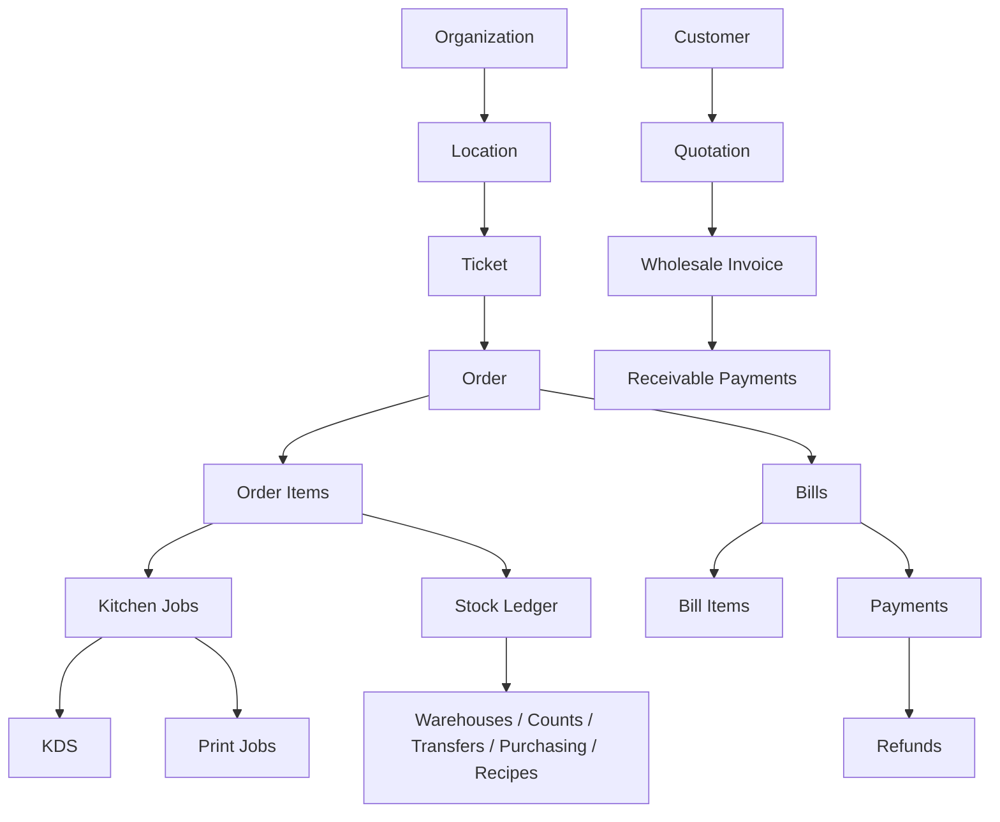

# Domain Model

## Ticket Core

Ticket is the work unit for every business type. It can represent a dining group, takeaway order, retail sale, wholesale customer order, pickup job, or any other sales work.

Foundation implements Organization, Membership, Location, Employee, Role, Permission, Session, Invitation, Audit, and Idempotency metadata.

Catalog, Ticket sales core, Kitchen Jobs, Print Jobs, inventory core, and wholesale core are now migrated and exposed through API routes. Advanced merge/transfer flows, modifiers, receipts, inventory idempotency hardening, sale handover hooks, recipe consumption, quotation-to-Ticket conversion, offline sync, and realtime updates remain later-phase work.

## Ticket Rules

- Internal IDs are UUIDs.
- Display numbers use `T-YYYYMMDD-0001`, scoped by location and business date.
- Ticket labels are editable free text, such as customer name or pickup time.
- One Ticket has one main Order.
- One Order can create many Bills.
- Bill Items allocate quantities from Order Items; they do not duplicate sold items.
- Issued Bills are immutable. Void unpaid bills; refund paid bills.
- Payment status is derived from captured payments and refunds.
- Kitchen status and payment status are independent.
- Closing a Ticket requires all active quantities billed, no outstanding due, and required service work completed or cancelled.
- Splitting bills, printing, and opening a Ticket never reduce stock.
- Inventory changes are append-only stock movements from adjustments, counts, transfers, purchase receipts, and later sale/recipe hooks.
- Wholesale invoices store item price snapshots and receivable payments are append-only.

## States

Ticket: `OPEN`, `CLOSED`, `CANCELLED`, `MERGED`

Order: `DRAFT`, `OPEN`, `COMPLETED`, `CANCELLED`

Bill: `DRAFT`, `ISSUED`, `VOIDED`

Kitchen Job Item: `QUEUED`, `PREPARING`, `READY`, `SERVED`, `CANCELLED`

Payment status is derived: `unpaid`, `partial`, `paid`, `refunded`.

## Explicit Non-Goal

There is no table entity, table area, table assignment, table merge, table transfer, table permission, or table workflow. Movable physical tables can be written into Ticket labels when staff need a hint, but the backend does not model them.
